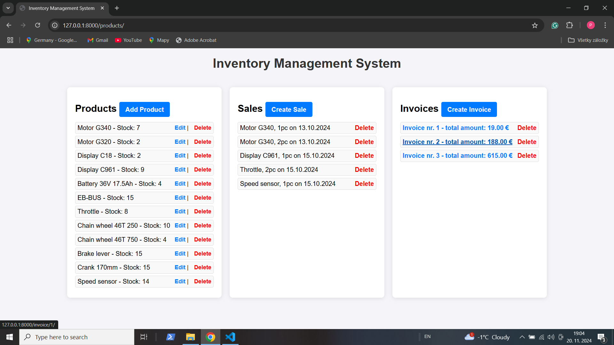

***If you want to check the same project using Flask and MongoDB: https://github.com/emax-77/Inventory-Managemet-System-Flask-MongoDB.git***

# Inventory Management System
## Simple IMS for small business using Django

## Project includes:
- Product Management (C-R-U-D)
- Sales 
- Invoices 
- Email notifications when stock is low

## What's new
- Invoice downloading

### Easy to run - Django with SQLite3 only
- install Django
- clone
- run :)

***to try email notifications, you need to set up your email configuration in settings.py***

### Screenshot

